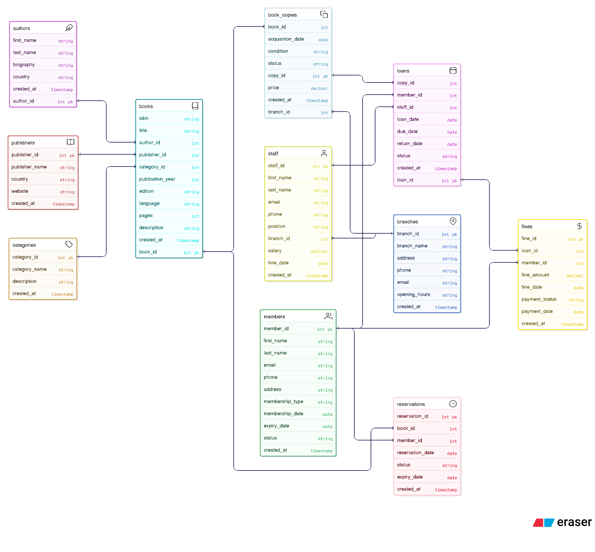

# 📚 Library Management System – PostgreSQL

## Overview
This project implements a **relational Library Management System (LMS)** using **PostgreSQL**, designed to model real-world library operations across multiple branches. The database supports catalog management, member and staff handling, book circulation, reservations, fines, and automated business logic using advanced PostgreSQL features.

The system is built with a strong focus on **data integrity, normalization, and real-world workflows**, making it suitable for learning, demonstration, and portfolio purposes.

---

## 🧱 Database Design Highlights
- Fully normalized relational schema
- Multi-branch library support
- Separation of book metadata and physical copies
- Enforcement of business rules at the database level
- Optimized with indexes for performance

---

## 📂 Project Structure

| Folder | Description |
|--------|------------------------------|
| schema/ | Core database tables and relationships |
| advanced_features/ | Views, functions, procedures, triggers |
| data/ | Dummy data for testing |
| queries/ | Business and analytical SQL queries |

---

## 📐 ER Diagram

---

## 🧩 Core Entities
- **Branches** – Library locations
- **Staff** – Librarians and employees
- **Members** – Library users with membership tiers
- **Books** – Book metadata (ISBN, author, publisher, category)
- **Book Copies** – Physical inventory per branch
- **Loans** – Book borrowing transactions
- **Reservations** – Book reservation requests
- **Fines** – Penalties for overdue returns

---

## ⚙️ Advanced PostgreSQL Features

### 🔍 Views
- Available books by branch
- Current loans with overdue calculations
- Member activity and fine summary
- Book usage statistics
- Overdue loans and fine status

### 🧠 Functions
- Fine calculation for overdue books
- Borrowing eligibility validation
- Book availability lookup by ISBN

### 🔄 Stored Procedures
- Issue book to a member with rule enforcement
- Process book returns

### ⚡ Triggers
- Automatic book copy status updates
- Automatic fine generation on late returns
- Automatic overdue status updates

> Triggers act as a **data integrity safeguard**, even if data is modified outside stored procedures.

---

## ▶️ Execution Order

Run the SQL files in the following order:

1. `schema/db_schema.sql`
2. `advanced_features/adv_features.sql`
3. `dummy_data/dummy_data.sql` *(optional)*
4. `queries/queries.sql` *(for testing and reporting)*

---

## 🧪 Sample Use Cases
- Issue and return books
- Enforce borrowing limits per membership type
- Track overdue books and fines
- View real-time availability by branch
- Generate analytical reports using views

---

## 🛠️ Technologies Used
- **PostgreSQL**
- **PL/pgSQL**
- SQL (DDL, DML, Views, Triggers)
- Git & GitHub

---

## 📈 Future Improvements
- Role-based access control
- Configurable fine rates
- Scheduled jobs using `pg_cron`
- Audit logging

---

## 👤 Author
**Abhishek Kumar**  
Database-focused project for learning and portfolio demonstration.

